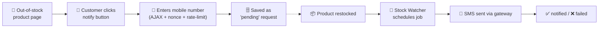

<div align="center">

# 📦🔔 Unavailable Product SMS Notifier

### Let customers get an **SMS** the moment your out-of-stock WooCommerce products are back 🚀

<p>
  
  
  
  
  
  
</p>

<p>
  <a href="https://sms.ir"></a>
  <a href="https://kavenegar.com"></a>
  <a href="https://farazsms.com"></a>
  <a href="https://www.melipayamak.com"></a>
</p>

</div>

---

A WordPress / WooCommerce plugin that lets customers request an **SMS notification** when an out-of-stock product comes back in stock. When you restock the product, the plugin automatically sends an SMS to everyone who signed up — using popular Iranian SMS providers.

> 🌐 The customer-facing UI and admin settings are in **Persian (RTL)**, and the supported SMS gateways are Iranian. The plugin is primarily aimed at Iranian WooCommerce stores.

---

## ✨ Features

- 🔔 **"Notify me when available" button** rendered automatically on out-of-stock single product pages.
- 🎨 **Customizable popup/modal** — customers enter their mobile number to subscribe. The popup shows the product, accepts Persian/Arabic digits, and becomes a bottom sheet on phones. Colors, text, labels, direction (LTR/RTL), and messages are all configurable from the admin panel, with a **live preview** on the settings page.
- ⚡ **Automatic dispatch on restock** — listens for WooCommerce stock changes (status + quantity, including variations) and sends queued notifications in the background via [Action Scheduler](https://actionscheduler.org/) when available, falling back to synchronous sending.
- 📨 **Multiple Iranian SMS gateways** out of the box:
  - [SMS.ir](https://sms.ir)
  - [Kavenegar](https://kavenegar.com)
  - [FarazSMS](https://farazsms.com)
  - [MeliPayamak](https://www.melipayamak.com)
- 🧩 **Pattern / template based messages** — each gateway sends via its verified template, passing the product name as a parameter.
- 🎯 **Display targeting** — show the notify button on *all* out-of-stock products, only selected **categories**, or only selected **products**.
- 🛡️ **Anti-spam / rate limiting** — configurable per-IP (hourly) and per-phone (daily) request limits using a fixed-window counter built on the WordPress transient API.
- 🗂️ **Admin requests panel** — browse, filter (status / phone / date range), paginate, and re-queue notifications (single + bulk). Requests are **never deleted**, so reports always reflect the full history.
- 📊 **Statistics page** — top products, top categories, daily request trends, and status breakdown.
- 📱 **Iranian mobile number validation & normalization** (accepts `09xxxxxxxxx`, `+98...`, `0098...`).
- 🔒 **PII-aware logging** — debug logs only when `WP_DEBUG` is enabled.

---

## ✅ Requirements

| | Requirement |
|---|---|
| 🟦 **WordPress** | 6.0+ |
| 🟪 **WooCommerce** | Installed and active |
| 🐘 **PHP** | 7.4+ |
| 📨 **SMS account** | One supported provider + a verified message **pattern/template** |

---

## 🚀 Installation

1. Copy the `unavailable-product-sms-notifier` directory into your `wp-content/plugins/` directory.
2. In the WordPress admin, go to **Plugins** and activate **Unavailable Product SMS Notifier**. *(Activation creates the `{prefix}_upsn_notify_requests` database table.)*
3. Make sure WooCommerce is active — an admin notice appears if it is missing.

---

## ⚙️ Configuration

After activation, three pages are added under the **WooCommerce** menu:

| Page | Slug | What it does |
|------|------|--------------|
| ⚙️ **تنظیمات اطلاع‌رسانی پیامکی** (Settings) | `upsn-settings` | Button visibility, button/modal/form styling, messages, anti-spam limits, and SMS provider credentials. |
| 🗂️ **درخواست‌های اطلاع‌رسانی** (Requests) | `upsn-requests` | View, filter, paginate, and re-queue notification requests. |
| 📊 **آمار اطلاع‌رسانی** (Statistics) | `upsn-stats` | Top products/categories, daily trends, and status breakdown. |

### 📨 SMS provider setup

In **Settings → ارائه‌دهنده پیامک (SMS Provider)**, pick your gateway and fill in the relevant credentials. Fields shown depend on the selected gateway:

| Gateway | Required fields | Pattern field |
|---------|----------------|---------------|
| 🟧 **SMS.ir** | API Key | Numeric template ID |
| 🟦 **Kavenegar** | API Key | Template name |
| 🟪 **FarazSMS** | Username, Password, Line number | `pattern_code` |
| 🟥 **MeliPayamak** | Username, Password | `bodyId` |

> 💡 The **product parameter name** setting controls the variable name in your SMS template that receives the product's name (for Kavenegar this is the token key, e.g. `token`; not used for MeliPayamak). Long product names are truncated to 24 characters to fit template constraints.

---

## 🔍 How it works



1. A customer visits an out-of-stock product page and clicks the notify button.
2. The popup collects and validates their mobile number, which is submitted via AJAX (nonce-protected, rate-limited) and stored as a `pending` request.
3. When the product is restocked, `UPSN_Stock_Watcher` hooks into WooCommerce stock events and schedules a background job.
4. The job loads all `pending` requests for that product and sends each customer an SMS via the configured gateway, marking each request `notified` or `failed`.

---

## 🗂️ Project structure

```
unavailable-product-sms-notifier/
├── unavailable-product-sms-notifier.php   # Plugin bootstrap, constants, dependency check
├── uninstall.php                          # Removes settings only; request history is kept
├── includes/
│   ├── class-database.php                 # Table creation, CRUD, statistics queries
│   ├── class-frontend.php                 # Button + modal rendering, asset enqueue
│   ├── class-request-handler.php          # AJAX handler, validation, rate limiting
│   ├── class-sms-sender.php               # Gateway dispatcher
│   ├── class-stock-watcher.php            # Restock detection + background scheduling
│   └── gateways/
│       ├── class-gateway-base.php         # Shared gateway contract
│       ├── class-gateway-smsir.php
│       ├── class-gateway-kavenegar.php
│       ├── class-gateway-farazsms.php
│       └── class-gateway-melipayamak.php
├── admin/
│   ├── class-admin-panel.php              # Requests + statistics pages, bulk actions
│   ├── class-settings.php                 # Settings API, fields, sanitization, inline CSS
│   └── views/
│       ├── requests-table.php
│       └── statistics.php
└── assets/
    ├── css/  (admin.css, popup.css)
    └── js/   (popup.js, admin.js)
```

---

## 🔐 Data & privacy

- 🗄️ Subscriber phone numbers are stored in the `{prefix}_upsn_notify_requests` table.
- ♻️ Request data is **never removed**: not on deactivation, not on uninstall, and there is no delete action in the admin. Only the settings (which hold SMS gateway credentials) are removed on uninstall.
- 🔁 **Re-queue** adds a new `pending` request for the same phone + product and leaves the original row untouched, so earlier `notified` / `failed` history stays in the reports.
- 🔒 Debug output (which may contain PII) is only written to the PHP error log when `WP_DEBUG` is enabled.

---

## 📜 License

Released under the **[GPL-2.0-or-later](https://www.gnu.org/licenses/gpl-2.0.html)** license.

<div align="center">

Made with ☕ for Iranian WooCommerce stores

</div>
