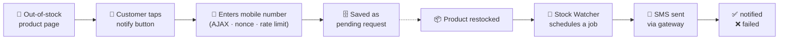

<div align="center">


# Unavailable Product SMS Notifier

**Turn "out of stock" into a sale.**<br>
Customers leave their mobile number on a sold-out WooCommerce product, and get an SMS the moment it's back.

<br>

[](https://wordpress.org)
[](https://woocommerce.com)
[](https://www.php.net)
[](#)
[](https://www.gnu.org/licenses/gpl-2.0.html)
[](#)

[Features](#-features) · [Install](#-installation) · [Configure](#%EF%B8%8F-configuration) · [How it works](#-how-it-works) · [Privacy](#-data--privacy)

</div>

<br>

> [!NOTE]
> The storefront popup and the admin panel are written in **Persian (RTL)**, and the bundled SMS gateways are Iranian providers. The plugin is built for Iranian WooCommerce stores, but every label and message is editable in the settings.

## ✨ Features

|   |   |
|---|---|
| 🔔 **Notify-me button** | Appears automatically on out-of-stock product pages. Show it on all products, selected **categories**, or selected **products**. |
| 🎨 **Customizable popup** | Colors, radius, text, direction (LTR/RTL) and messages are all configurable, with a **live preview** on the settings page. It becomes a bottom sheet on phones. |
| ⚡ **Automatic dispatch** | Watches WooCommerce stock changes (status and quantity, variations included) and sends in the background through [Action Scheduler](https://actionscheduler.org/), falling back to synchronous sending. |
| 📨 **4 SMS gateways** | [SMS.ir](https://sms.ir), [Kavenegar](https://kavenegar.com), [FarazSMS](https://farazsms.com) and [MeliPayamak](https://www.melipayamak.com), all sent through your verified pattern/template. |
| 🛡️ **Anti-spam** | Per-IP (hourly) and per-phone (daily) rate limits, plus a nonce-protected AJAX endpoint. |
| 📱 **Mobile validation** | Accepts `09xxxxxxxxx`, `+98…`, `0098…`, and Persian/Arabic digits. |
| 🗂️ **Requests panel** | Filter by status, phone and date range. Paginate, re-queue single or bulk requests. History is never deleted. |
| 📊 **Statistics** | Top products and categories, daily request trend and a status pipeline with delivery success rate. |
| 🔒 **PII-aware logging** | Debug output is written only when `WP_DEBUG` is on. |

## ✅ Requirements

| | |
|---|---|
| **WordPress** | 6.0 or newer |
| **WooCommerce** | Installed and active |
| **PHP** | 7.4 or newer |
| **SMS account** | One supported provider with a verified message **pattern/template** |

## 🚀 Installation

1. Copy the `unavailable-product-sms-notifier` folder into `wp-content/plugins/`.
2. In the WordPress admin, open **Plugins** and activate **Unavailable Product SMS Notifier**.
   Activation creates the `{prefix}_upsn_notify_requests` table.
3. Make sure WooCommerce is active. An admin notice appears if it is missing.

```bash
# or from a shell
cd wp-content/plugins
git clone https://github.com/alirzaghlmpr/unavalable-product-sms-sender.git
cp -r unavalable-product-sms-sender/unavailable-product-sms-notifier .
wp plugin activate unavailable-product-sms-notifier
```

## ⚙️ Configuration

Three pages are added under the **WooCommerce** menu:

| Page | Slug | Purpose |
|------|------|---------|
| ⚙️ **Settings** (تنظیمات) | `upsn-settings` | Button visibility, styling, messages, anti-spam limits and gateway credentials. |
| 🗂️ **Requests** (درخواست‌ها) | `upsn-requests` | View, filter, paginate and re-queue requests. |
| 📊 **Statistics** (آمار) | `upsn-stats` | Top products and categories, daily trend and status breakdown. |

### SMS provider setup

Open **Settings → SMS Provider**, pick a gateway and fill in its credentials. Only the fields for the selected gateway are shown.

| Gateway | Credentials | Pattern field |
|---------|-------------|---------------|
| **SMS.ir** | API key | Numeric template ID |
| **Kavenegar** | API key | Template name |
| **FarazSMS** | Username, password, line number | `pattern_code` |
| **MeliPayamak** | Username, password | `bodyId` |

> [!TIP]
> The **product parameter name** setting is the variable in your SMS template that receives the product name. For Kavenegar it is the token key (for example `token`). MeliPayamak doesn't use it. Product names longer than 24 characters are truncated to fit template limits.

## 🔍 How it works



1. A customer opens an out-of-stock product and taps the notify button.
2. The popup validates the mobile number and submits it over AJAX (nonce-protected, rate-limited). It is stored as a `pending` request.
3. When the product is restocked, `UPSN_Stock_Watcher` catches the WooCommerce stock event and schedules a background job.
4. The job loads every `pending` request for that product, sends each customer an SMS through the configured gateway, and marks it `notified` or `failed`.

## 🗂️ Project structure

<details>
<summary>Show the file tree</summary>

```
unavailable-product-sms-notifier/
├── unavailable-product-sms-notifier.php   # Bootstrap, constants, dependency check
├── uninstall.php                          # Removes settings only; request history is kept
├── includes/
│   ├── class-database.php                 # Table creation, CRUD, statistics queries
│   ├── class-frontend.php                 # Button + popup rendering, asset enqueue
│   ├── class-request-handler.php          # AJAX handler, validation, rate limiting
│   ├── class-sms-sender.php               # Gateway dispatcher
│   ├── class-stock-watcher.php            # Restock detection + background scheduling
│   └── gateways/
│       ├── class-gateway-base.php         # Shared gateway contract
│       ├── class-gateway-smsir.php
│       ├── class-gateway-kavenegar.php
│       ├── class-gateway-farazsms.php
│       └── class-gateway-melipayamak.php
├── admin/
│   ├── class-admin-panel.php              # Requests + statistics pages, bulk actions
│   ├── class-settings.php                 # Settings API, fields, sanitization
│   └── views/
│       ├── requests-table.php
│       └── statistics.php
└── assets/
    ├── css/  (admin.css, popup.css)
    ├── js/   (admin.js, popup.js)
    └── img/  (icon-128.png, icon-256.png)
```

</details>

## 🔐 Data & privacy

- Subscriber phone numbers live in the `{prefix}_upsn_notify_requests` table.
- Request data is **never removed**: not on deactivation, not on uninstall, and there is no delete action in the admin. Only the settings, which hold gateway credentials, are removed on uninstall.
- **Re-queue** adds a new `pending` request for the same phone and product and leaves the original row untouched, so earlier `notified` / `failed` history stays in the reports.
- Debug output, which may contain personal data, is written to the PHP error log only when `WP_DEBUG` is enabled.

## 📜 License

Released under the [GPL-2.0-or-later](https://www.gnu.org/licenses/gpl-2.0.html) license.

<div align="center">
<br>

Made with ☕ for Iranian WooCommerce stores

</div>
